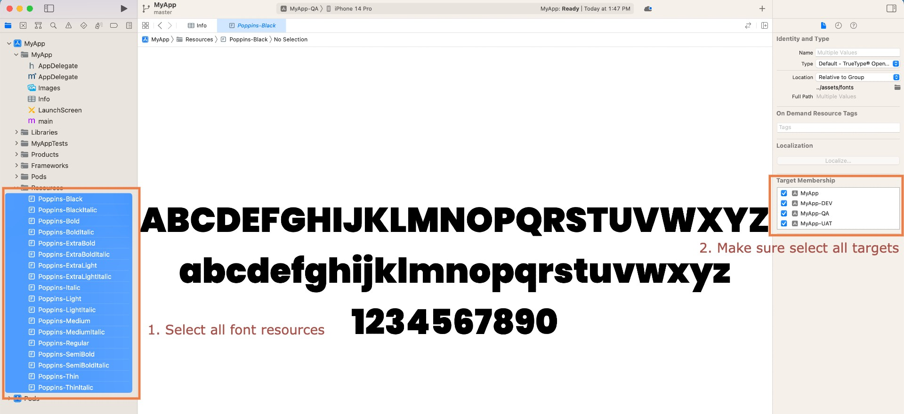

# Template

Welcome to the React Native Template with Environment Configuration! We're thrilled to introduce you to a streamlined way to kickstart your React Native projects, tailored for different Software Development Life Cycle (SDLC) phases. Whether you're a seasoned developer or just getting started, this template is designed to simplify your workflow and make your app development process smoother and more efficient.

## **Key Features**

- **Environment Isolation:** Easily switch between different SDLC phases by selecting the appropriate environment file. No more manual configuration changes – simply update your environment file, and you're ready to go.
- **Effortless Setup:** Get started quickly with our template by cloning the repository and following the straightforward setup instructions. We've done the heavy lifting so you can focus on building your app.
- **********************************NPM scripts ready:********************************** This template comes with pre-configured npm scripts that simplify common development tasks such as building in different environments and running your React Native application.

## Libraries Used

- **[React Navigation](https://reactnavigation.org/) -** Routing and navigation for Expo and React Native apps
- **[Async Storage](https://react-native-async-storage.github.io/async-storage/) -** Data storage system for React Native
- **[Axios](https://axios-http.com/docs/intro) -** Promise based HTTP client for the browser and node.js
- **[Native Base](https://docs.nativebase.io/)** - Accessible, utility-first component library for Android, iOS and Web
- **[React Native Config](https://github.com/luggit/react-native-config) -** Module to expose config variables to your javascript code in React Native
- **[React Native Rename](https://github.com/junedomingo/react-native-rename) -** Rename react-native app with just one command
- **[React Native Vector Icons](https://github.com/oblador/react-native-vector-icons) -** Customizable Icons for React Native
- **[Zustand](https://docs.pmnd.rs/zustand/getting-started/introduction) -** A small, fast, and scalable bearbones state management solution

## Get Started

Follow these steps to set up and run your React Native project with our template:

### **Prerequisites**

Before you begin, ensure you have the following prerequisites installed:

- **[Node.js](https://nodejs.org/en/)**
- **[Yarn](https://classic.yarnpkg.com/en/docs/install)**
- **[Xcode](https://developer.apple.com/xcode/)** (for iOS development)

### **Step 1: Clone the Repository**

Clone the template repository to your local machine using the following command:

```bash
$ git clone https://github.com/Shenggg2000/app-template.git
```

### **Step 2: Navigate to the Project Folder**

Move into the project folder using the following command:

```bash
cd app-template
```

### **Step 3: Configure Environment Variables**

Before proceeding, configure your environment variables for each SDLC phase by following these steps:

1. In the root directory of your project, locate the following files:
    - **`.env.example.dev`**
    - **`.env.example.qa`**
    - **`.env.example.uat`**
    - **`.env.example.prod`**
2. Rename these files as follows:
    - **`.env.dev`**
    - **`.env.qa`**
    - **`.env.uat`**
    - **`.env.prod`**
3. Open each of the renamed **`.env`** files (**`.env.dev`**, **`.env.qa`**, **`.env.uat`**, **`.env.prod`**) and provide the specific environment variables and values relevant to each SDLC phase.

### **Step 4: Install Dependencies**

Install project dependencies using Yarn:

```bash
yarn install
```

### **Step 5: Rename the App**

Use the following command to rename the app to your preferred name. Replace **`"yourappname"`** with your desired app name:

```bash
npx react-native-rename "yourappname" --skipGitStatusCheck
```

### **Step 6 (Optional): Update App Name (If Needed)**

If you want the app name to include the environment name, follow these steps:

******iOS******

- Navigate to **`ios/yourappname/Info.plist`**.
- Update **CFBundleDisplayName** in line 8 from:

```xml
<key>CFBundleDisplayName</key>
<string>yourappname</string>
```

to:

```xml
<key>CFBundleDisplayName</key>
<string>${APP_NAME}</string>
```

**************Android**************

- Navigate to **`android/app/src/main/res/values/strings.xml`**.
- Update **app_name** in line 2 from:

```xml
<string name="app_name">yourappname</string>
```

to:

```xml
<string name="app_name">@string/APP_NAME</string>
```

This step is optional and should only be performed if you want to include the environment name in your app's display name.

### **Step 7: Install Pod Dependencies**

Install pod dependencies for iOS by running:

```bash
npx pod-install ios
```

### **Step 8: Start Metro Server**

Start the Metro server by running:

```bash
yarn run start
```

### **Step 9: Build and Run the App**

Open another terminal window and build the project in the development environment:

```bash
yarn run ios
```

Now, your React Native project is up and running with the configured environment settings. Happy coding!

## Customize Font

Enhance the visual appeal of your React Native project by adding custom fonts. Follow these steps to integrate your preferred font family into the template:

### **Step 1: Download Font Family**

Download your preferred font family from Google Fonts or other font providers. Ensure that you have the necessary .ttf font files.

### **Step 2: Replace Default Fonts**

Navigate to the **`assets/fonts`** directory in your project and replace the default .ttf files with your downloaded font family .ttf files.

### **Step 3: Link Font Assets**

Open your terminal in the root directory of your project and run the following command to link the font assets:

```bash
npx react-native-asset
```

### **Step 4: Configure Fonts for iOS**

For iOS, follow these additional steps:

- Open Xcode and navigate to your project's **`ios`** folder.
- In Xcode, select all the font .ttf files that you placed in the **`assets/fonts`** directory under the "Resources" folder.
- In the right panel, tick the checkbox for all four targets to ensure that the fonts are included in the build.



### **Step 5: Update Font Configuration**

Navigate to **`src/theme/config.ts`** in your project and locate the default font family name. Change it to your preferred font family name.

### **Step 6: Start the Metro Server**

Start the Metro server by running the following command:

```bash
yarn run start
```

### **Step 7: Rebuild the Project**

Open another terminal window and rebuild the project to apply the font changes:

```bash
yarn run ios
```

Your React Native project is now configured with your custom font family, giving your app a unique and personalized look. Enjoy the enhanced typography in your application!
