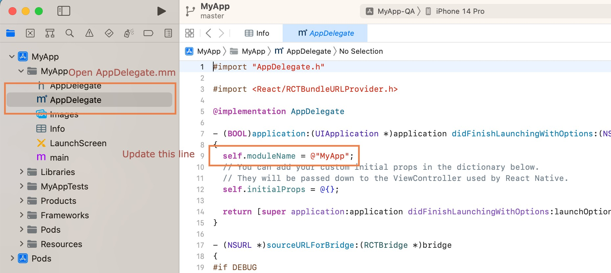
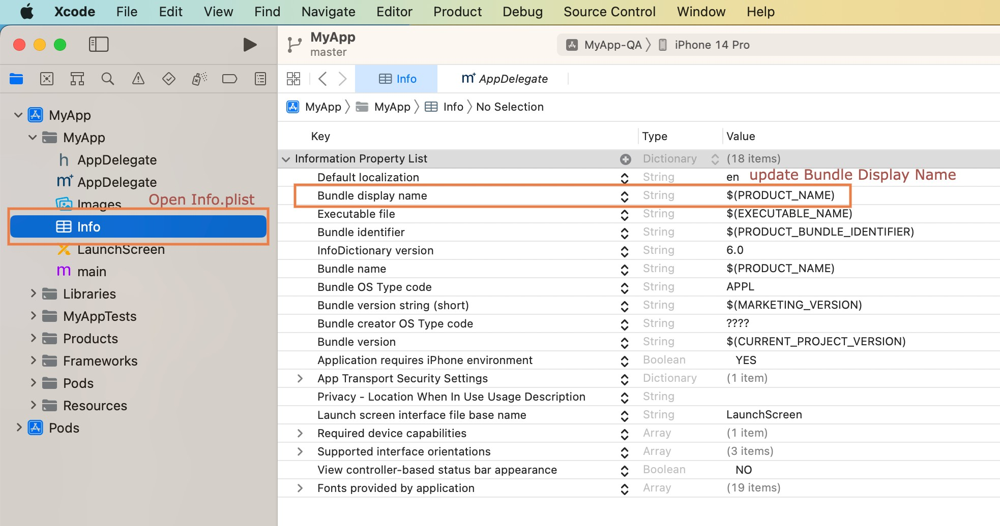
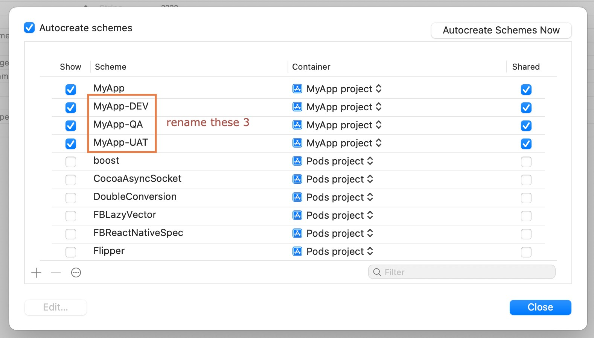

# Template

Welcome to the React Native Template with Environment Configuration! We're thrilled to introduce you to a streamlined way to kickstart your React Native projects, tailored for different Software Development Life Cycle (SDLC) phases. Whether you're a seasoned developer or just getting started, this template is designed to simplify your workflow and make your app development process smoother and more efficient.

## **Key Features**

- **Environment Isolation:** Easily switch between different SDLC phases by selecting the appropriate environment file. No more manual configuration changes – simply update your environment file, and you're ready to go.
- **Effortless Setup:** Get started quickly with our template by cloning the repository and following the straightforward setup instructions. We've done the heavy lifting so you can focus on building your app.
- **********************************NPM scripts ready:********************************** This template comes with pre-configured npm scripts that simplify common development tasks such as building in different environments and running your React Native application.

## Libraries Used

- **[React Navigation](https://reactnavigation.org/) -** Routing and navigation for Expo and React Native apps
- **[Async Storage](https://react-native-async-storage.github.io/async-storage/) -** Data storage system for React Native
- **[Axios](https://axios-http.com/docs/intro) -** Promise based HTTP client for the browser and node.js
- **[Native Base](https://docs.nativebase.io/)** - Accessible, utility-first component library for Android, iOS and Web
- **[React Native Config](https://github.com/luggit/react-native-config) -** Module to expose config variables to your javascript code in React Native
- **[React Native Rename](https://github.com/junedomingo/react-native-rename) -** Rename react-native app with just one command
- **[React Native Vector Icons](https://github.com/oblador/react-native-vector-icons) -** Customizable Icons for React Native
- **[Zustand](https://docs.pmnd.rs/zustand/getting-started/introduction) -** A small, fast, and scalable bearbones state management solution

## Get Started

Follow these steps to set up and run your React Native project with our template:

### **Prerequisites**

Before you begin, ensure you have the following prerequisites installed:

- **[Node.js](https://nodejs.org/en/)**
- **[Yarn](https://classic.yarnpkg.com/en/docs/install)**
- **[Xcode](https://developer.apple.com/xcode/)** (for iOS development)

### **Step 1: Clone the Repository**

Clone the template repository to your local machine using the following command:

```bash
$ git clone https://github.com/Shenggg2000/app-template.git
```

### **Step 2: Navigate to the Project Folder**

Move into the project folder using the following command:

```bash
cd app-template
```

### **Step 3: Install Dependencies**

Install project dependencies using Yarn:

```bash
yarn install
```

### **Step 4: Rename the App**

Use the following command to rename the app to your preferred name. Replace **`"yourappname"`** with your desired app name:

```bash
npx react-native-rename "yourappname" --skipGitStatusCheck
```

### **Step 5: Configure iOS Settings**

### **Step 5.1: Open the iOS Project in Xcode**

Navigate to the **`app-template/ios`** folder and open the Xcode project.

### **Step 5.2: Update AppDelegate.mm**



In the project structure, open **`yourappname/yourappname/AppDelegate.mm`** and change the code on line 9 from:

```objectivec
self.module = @"MyApp";
```

to:

```objectivec
self.module = @"yourappname";
```

### Step 5.3: Update Info.plist



In the project structure, open **`yourappname/yourappname/Info.plist`** and change the "Bundle display name" value to **`${PRODUCT_NAME}`**.

### Step 5.4: Update Schemas



In Xcode, go to **`Product > Scheme > Manage Schemes`** and update the schema names as follows:

- Change 'MyApp-DEV' to 'yourappname-DEV'
- Change 'MyApp-QA' to 'yourappname-QA'
- Change 'MyApp-UAT' to 'yourappname-UAT'

### **Step 6: Install Pod Dependencies**

Install pod dependencies for iOS by running:

```bash
npx pod-install iosyarn run start
```

### **Step 7: Start Metro Server**

Start the Metro server by running:

```bash
yarn run start
```

### **Step 8: Build and Run the App**

Open another terminal window and build the project in the development environment:

```bash
yarn run ios
```

Now, your React Native project is up and running with the configured environment settings. Happy coding!

## Customize Font
